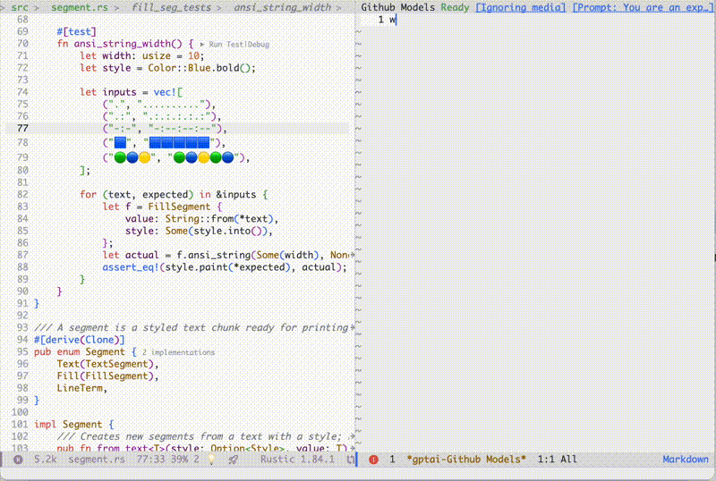

# gptel-aibo

**gptel-aibo** is an AI writing assistant system built on top of
[gptel](https://github.com/karthink/gptel) .
It helps you create and manage content in Emacs, including code, documentation,
and even novels. As you talk to the LLM, it automatically sends the content (or
a portion of it) that you're currently working on, allowing you to refer to
elements like "this function," "this class," "this file," etc. It also defines
an action set and its format with the LLM, so once a response is received, you
can easily apply the suggestions with a single command (
`gptai-apply-last-suggestions`, bound to `C-c !`).

The term *aibo*, meaning partner, is currently ambiguous—it could refer to
gptel’s partner, or the user’s.

## Installation
This package requires [gptel](https://github.com/karthink/gptel) and access to any
LLM through it. See its README for details on setting up your LLM environment.

Since this package is developed based on the Doom Emacs `gptel` package, it uses
a very recent version of `gptel`. If you're not using Doom Emacs, it's recommended
to install `gptel` using `straight.el` or the built-in `package-vc-install`.

### Doom Emacs
In your `packages.el`, add this line:
```elisp
(package! gptel-aibo :recipe (:host github :repo "dolmens/gptel-aibo"))
```
**Note**: In the `gptel-aibo` interface, it overrides the `flycheck` keybinding
`C-c !` (you generally won't need to use `flycheck` in the `gptel-aibo` interface,
especially with the shortcut key). Therefore, if you want to configure further
using `use-package!`, make sure `gptel-aibo` is loaded after `flycheck`.
```elisp
(use-package! gptel-aibo
  :after (gptel flycheck))
```
Alternatively, define a different keybinding:
```elisp
(use-package! gptel-aibo
  :after (gptel)
  :config
  (define-key gptai-mode-map (kbd "C-c /") #'gptai-apply-last-suggestions))
```

## Usage
With the `gptai` interactive command, you can open or switch to an existing
`gptel-aibo` console, which is a `markdown` page with the `gptai` minor mode
enabled, an extension of `gptel-mode`.

To get started, open your file, move the cursor to the section you're working on,
and then switch to the gptai console. There, you can talk to the LLM and receive
suggestions. Use `gptai-send` to send your request, which is bound to `C-c RET`,
just like the send command in `gptel-mode`.

Once a response is received, you can apply it using the command 
`gptai-apply-last-suggestions` (bound to `C-c !`), or continue the conversation
with more detailed instructions.

### Completion at point
`gptel-aibo` also provides a minor mode `gptai-complete-mode` and an interactive
command `gptai-complete-at-point`, which can insert relevant content at the
current position based on the context. For example, after writing a function
comment, you can use this single command to generate the corresponding code.
Use TAB or Enter to accept, and other keys to discard.

You can globally enable `gptai-complete-mode`, which has no side effects and
only works when you invoke it. You can also add it to specific mode hooks if
that suits your workflow. In the minor mode, `gptai-complete-at-point` is bound
to `C-c C-c i`. It’s a bit long, but less likely to upset someone by taking away
their favorite key. You can also bind your own key, for example:
- Doom Emacs
```elisp
(use-package! gptel-aibo
  :after (gptel)
  :config
  (define-key gptai-complete-mode-map (kbd "C-c i") #'gptai-complete-at-point)
  (add-hook 'prog-mode-hook #'gptai-complete-mode))
```

## Samples
### Query the logic, request additional cases


### Refactor a sample project


### Other common tasks & ideas
- generate a docstring for this function
- make the comment conform to Doxygen style
- generate the code for this function based on the comments (better done with `gptai-complete-at-point`)
- refactor this function and reorganize its logic
- reformat this function, as some lines are too long
- extract the common parts of functions A and B into a new function
- change the coding style from snake_case to camelCase (or vice versa)

## Customization
- `gptai--max-buffer-size`

  The size limit for the working buffer (the buffer you are currently working on)
  that is automatically sent to the LLM.
  
  If the buffer exceeds this size, only a portion of the content around the cursor
  (typically a function or class) will be sent. 
  
  The default value is 16000.

- `gptai--max-project-buffer-size`
  
  The size limit for other buffers within the same project as your working buffer
  that are automatically sent to the LLM.
  
  If a buffer exceeds this size, only the outline will be sent, if it has one.
  
  The default value is 16000.

- `gptai--max-project-buffer-count`
  
  The maximum number of buffers within the same project as your working buffer
  that are automatically sent to the LLM.
  
  The default value is 2.

## Miscellaneous
To make the gptai console look a bit fancier, I copied the following markdown
configuration from this Reddit post
[beautify_markdown_on_emacs](https://www.reddit.com/r/emacs/comments/10h9jf0/beautify_markdown_on_emacs/).
Thanks to the original author!

If you like it, you can add it to your configuration file.
```elisp
(after! markdown-mode
  (custom-set-faces!
    '(markdown-header-delimiter-face :foreground "#616161" :height 0.9)
    '(markdown-header-face-1 :height 1.8 :foreground "#A3BE8C" :weight extra-bold :inherit markdown-header-face)
    '(markdown-header-face-2 :height 1.4 :foreground "#EBCB8B" :weight extra-bold :inherit markdown-header-face)
    '(markdown-header-face-3 :height 1.2 :foreground "#D08770" :weight extra-bold :inherit markdown-header-face)
    '(markdown-header-face-4 :height 1.15 :foreground "#BF616A" :weight bold :inherit markdown-header-face)
    '(markdown-header-face-5 :height 1.1 :foreground "#b48ead" :weight bold :inherit markdown-header-face)
    '(markdown-header-face-6 :height 1.05 :foreground "#5e81ac" :weight semi-bold :inherit markdown-header-face)))
```

## Security issues
1. The file path and content of the current working buffer, as well as buffers
from the same project, may be sent to the LLM.
2. There are three actions defined in `gptel-aibo`: modification, creation,
and deletion. These actions are only allowed if the target is under the project
root of the current working buffer. If a buffer is not part of a project,
only modifications to itself can be executed.
3. Modifications and creations are saved immediately after they are applied,
with an additional confirmation required for deletion. While some changes can be
reverted using Emacs’ undo system, it’s best to place your project under version
control to enhance safety and recoverability.
